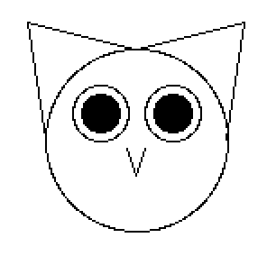

| **Name the owl**
| Prof. Richard Eisenberg
| Fall 2017

[Back to syllabus](../syllabus.html)

The goal of this ungraded homework is to have the class come to a consensus on the
name of our pet owl:

(Perhaps some of you can draw a more convincing owl than I can. This one looks more like
a cat to me.)

To discuss, [make an account on Piazza](https://piazza.com/brynmawr/fall2017/cs113)
and start or join the conversation. Please use your College email address and
real name when
creating your Piazza account.

Please also fill out [this survey](https://docs.google.com/forms/d/e/1FAIpQLSf3YT00iTwC5n6r2-vHVKRbBSEkWeTTGlUfHT8EsHqi9F8tyQ/viewform?usp=sf_link) to get me to know you better.

Complete these tasks before class on Monday, September 11.
