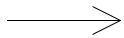

| **Method exercise**

[Back to syllabus](../syllabus.html)

In a new project folder, write an arrow compound object, looking like this:

Make the hotspot of your compound object be the tip of the arrow.
When the user moves the mouse, the whole arrow moves so that the tip points right
at the mouse.
When the user clicks the mouse,
make the arrow grow longer (just by making the main shaft reach further left).

See how this works by downloading [this file](Arrow.jar) and opening it.
